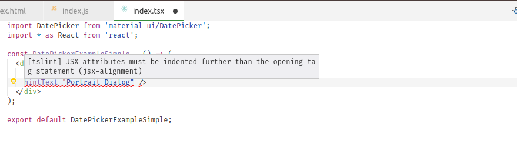

# Typescript + es6 react setup
This repo has the purpose of showing how make both **Es6** and **Typescript** coexist in a react project setup.

## Motivation
I am currently working on a few react projects written in javascript only. My team and I wanted to experiment and 
perhaps migrate to typescript, but since the code is already in production and contain tens of thousands of lines, it
would be unsiwise to try and switch everything at once.

## Running the project
```
npm install;
npm run build;
npm start;
```

* `npm run build;` will use webpack lint, test and bundle the files into a build folder.
* `npm start` will fire a very simple `express` server to provide the content in a default port.

## Bundling
It uses a simple [webpack](https://webpack.js.org/) configuration to bundle a set of static files (index.html and javascript chunks), babel is used to transpile es6 whereas
typescript compiler via ts-loader is used to transpile typescript.

### Where is it setup?
Mostly [webpack.config.js](https://github.com/phillipemoreira/react-with-ts-and-js/blob/master/webpack.config.js), but also [.babelrc](https://github.com/phillipemoreira/react-with-ts-and-js/blob/master/.babelrc) and [tsconfig.json](https://github.com/phillipemoreira/react-with-ts-and-js/blob/master/tsconfig.json)

## Linting
[ESLint](https://www.npmjs.com/package/eslint) is configured to extend some well adopted rules, such as [airbnb](https://github.com/airbnb/javascript) rules, as well as some
others defined in [.eslintrc](https://github.com/phillipemoreira/react-with-ts-and-js/blob/master/.eslintrc) file. Core typescrict static validations are performed by the compiler itself and they are performed during the webpack transpiling process, but [TSLint](https://www.npmjs.com/package/tslint) is also setup to run extend validations (such as styling and maintainability).

That being said, if you are using [vscode](https://code.visualstudio.com/) (which I strongly recommend you to do), you get static validations for both es6 and typescript if by install the **extensions** [ESLint](https://github.com/Microsoft/vscode-eslint) and [TSLint](https://github.com/Microsoft/vscode-tslint).



PS: Some TSLint rules require the compiler type checker, so they will not show in the editor, but they will fail during npm lint script.

### Where is it setup?
[.eslintrc](https://github.com/phillipemoreira/react-with-ts-and-js/blob/master/.eslintrc), [tslint.json](https://github.com/phillipemoreira/react-with-ts-and-js/blob/master/tslint.json) and we may say that also [tsconfig.json](https://github.com/phillipemoreira/react-with-ts-and-js/blob/master/tsconfig.json)

## Testing
[Jest](https://facebook.github.io/jest/) is the testing framework of choice, it is used, again, for testing both typescript and javascript files, Not only regular modules, but also react comopnents, for the react components we use [Enzyme](https://github.com/airbnb/enzyme) to mounting them. In order for jest to be able to understand both languages, we need to use preprocessors, for typescript we use
a third party packaged called [ts-jest](https://github.com/kulshekhar/ts-jest) and for es6 [es6-preprocessor](https://github.com/phillipemoreira/react-with-ts-and-js/blob/master/es6-preprocessor.js).

PS: Notice that we wouldn't have to explicitly define the es6-preprocessor if we weren't working with the typescript preprocessor as well.

### Coverage
By running `npm run build` or simply `npm run test` you get a coverage report in:

```
|---coverage
|------lcov-report
|---------index.html
```


#### Coverage threshold
Jest allows us to define a code coverage threshold, the build will fail if they are not met.

```
"coverageThreshold": {
    "global": {
        "statements": INCREASE_ME,
        "branches": INCREASE_ME,
        "functions": INCREASE_ME,
        "lines": INCREASE_ME
    }
},

### Where is it setup?
[jest.config.json](https://github.com/phillipemoreira/react-with-ts-and-js/blob/master/jest.config.json)
